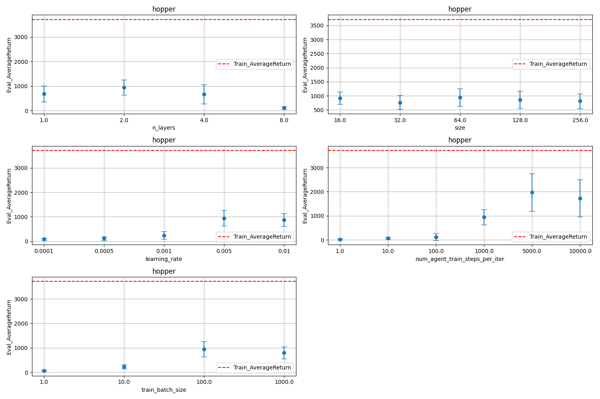
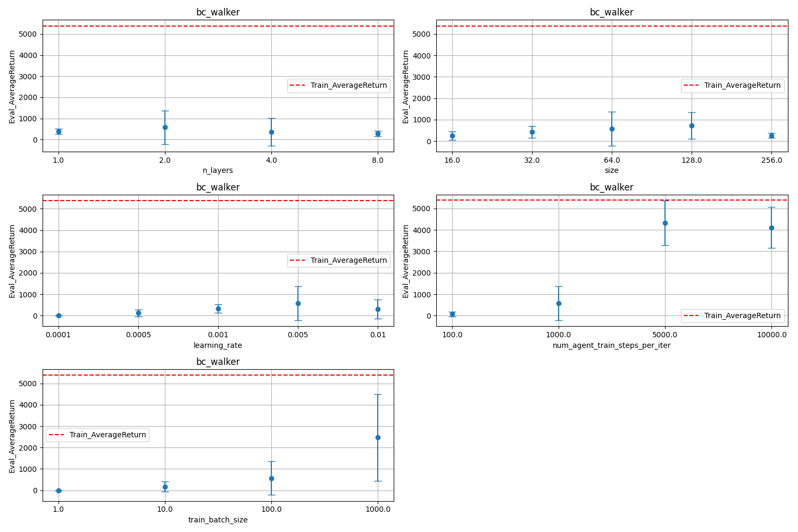
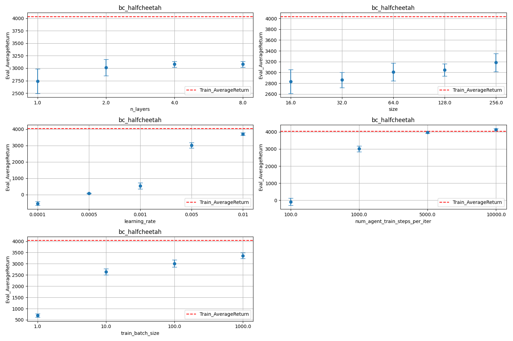
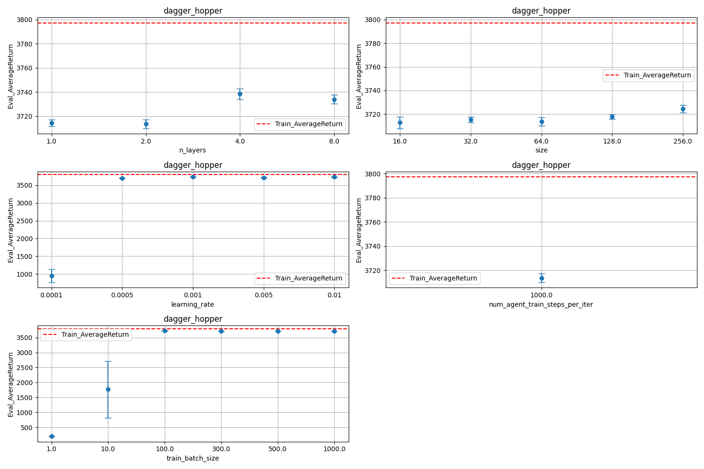
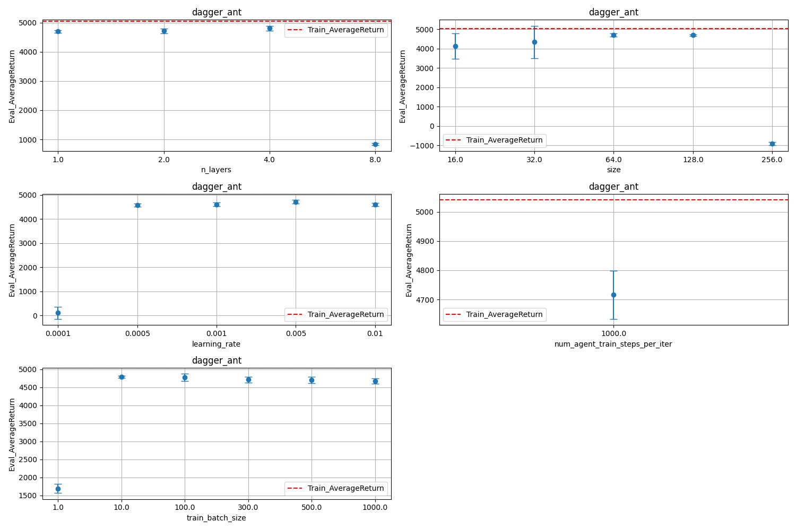

Here is a clean and structured markdown report for your experiments:

# Behavioral Cloning

## Best Hyperparameters

The first row - is an expert score.  

### Hopper-v4
|   Rank |   Eval_AverageReturn |   Eval_StdReturn |   learning_rate |   n_layers |   num_agent_train_steps_per_iter |   size |   train_batch_size |
|-------:|---------------------:|-----------------:|----------------:|-----------:|---------------------------------:|-------:|-------------------:|
|      0 |              3717.51 |         0.353036 |         nan     |        nan |                              nan |    nan |                nan |
|      1 |              3708.83 |         3.78945  |           0.005 |          2 |                            10000 |     16 |               1000 |
|      2 |              3653.88 |       105.177    |           0.01  |          2 |                            10000 |     16 |               1000 |
|      3 |              3518.8  |       371.827    |           0.005 |          1 |                            10000 |     64 |               1000 |
|      4 |              3436.38 |       193.833    |           0.005 |          2 |                            10000 |     64 |               1000 |
|      5 |              3363.43 |       374.61     |           0.01  |          2 |                            10000 |     32 |               1000 |
|      6 |              3253.96 |       364.65     |           0.005 |          4 |                            10000 |     32 |               1000 |
|      7 |              3249.88 |       361.619    |           0.01  |          1 |                            10000 |     32 |                100 |
|      8 |              3152.92 |       588.259    |           0.01  |          4 |                            10000 |     32 |               1000 |
|      9 |              2895.97 |       869.25     |           0.005 |          2 |                            10000 |    128 |               1000 |
|     10 |              2874.33 |      1114.72     |           0.005 |          1 |                            10000 |     32 |               1000 |

### Ant-v4
|   Rank |   Eval_AverageReturn |   Eval_StdReturn |   learning_rate |   n_layers |   num_agent_train_steps_per_iter |   size |   train_batch_size |
|-------:|---------------------:|-----------------:|----------------:|-----------:|---------------------------------:|-------:|-------------------:|
|      0 |              4681.89 |          30.7086 |         nan     |        nan |                              nan |    nan |                nan |
|      1 |              4793.67 |          64.1562 |           0.01  |          2 |                             5000 |     64 |                100 |
|      2 |              4765.21 |         180.16   |           0.01  |          2 |                             5000 |    128 |                500 |
|      3 |              4756.07 |          34.4552 |           0.005 |          2 |                             5000 |    128 |                500 |
|      4 |              4749.49 |          63.7852 |           0.005 |          2 |                             5000 |     32 |               1000 |
|      5 |              4727.12 |         156.506  |           0.01  |          2 |                             5000 |     64 |               1000 |
|      6 |              4724.18 |          61.8113 |           0.005 |          2 |                             5000 |    128 |               1000 |
|      7 |              4722.7  |          45.3199 |           0.01  |          2 |                             5000 |     32 |               1000 |
|      8 |              4722.02 |          75.5843 |           0.01  |          4 |                             5000 |     64 |               1000 |
|      9 |              4716.25 |         117.47   |           0.005 |          4 |                             5000 |    128 |               1000 |
|     10 |              4711.91 |          98.885  |           0.005 |          2 |                             5000 |     64 |               1000 |

### Walker2d-v4
|   Rank |   Eval_AverageReturn |   Eval_StdReturn |   learning_rate |   n_layers |   num_agent_train_steps_per_iter |   size |   train_batch_size |
|-------:|---------------------:|-----------------:|----------------:|-----------:|---------------------------------:|-------:|-------------------:|
|      0 |              5383.31 |          54.1525 |         nan     |        nan |                              nan |    nan |                nan |
|      1 |              5367.07 |          34.7416 |           0.005 |          2 |                             5000 |     64 |                500 |
|      2 |              5258.18 |          53.2514 |           0.01  |          2 |                             5000 |     64 |                500 |
|      3 |              5059.8  |         122.907  |           0.01  |          2 |                             5000 |    128 |                500 |
|      4 |              4413.9  |        1852.48   |           0.005 |          4 |                             5000 |     64 |                500 |
|      5 |              4331.6  |        1040.29   |           0.005 |          2 |                             5000 |     64 |                100 |
|      6 |              4290.77 |        1306.16   |           0.005 |          4 |                             5000 |    128 |                500 |
|      7 |              4114.14 |         963.959  |           0.005 |          2 |                            10000 |     64 |                100 |
|      8 |              3351.94 |        1895.23   |           0.005 |          8 |                             5000 |     64 |                500 |
|      9 |              3043.74 |        2450.76   |           0.001 |          2 |                             5000 |     64 |                500 |
|     10 |              2705.09 |        1110.86   |           0.01  |          4 |                             5000 |     64 |                500 |

### HalfCheetah-v4
|   Rank |   Eval_AverageReturn |   Eval_StdReturn |   learning_rate |   n_layers |   num_agent_train_steps_per_iter |   size |   train_batch_size |
|-------:|---------------------:|-----------------:|----------------:|-----------:|---------------------------------:|-------:|-------------------:|
|      0 |              4034.8  |          32.8678 |         nan     |        nan |                              nan |    nan |                nan |
|      1 |              4131.43 |          65.6496 |           0.005 |          2 |                            10000 |     64 |                100 |
|      2 |              4079.83 |         104.278  |           0.005 |          4 |                             5000 |    128 |                500 |
|      3 |              4077.75 |          67.7114 |           0.01  |          2 |                             5000 |    128 |                500 |
|      4 |              4075.57 |          52.2531 |           0.005 |          4 |                             5000 |    256 |                500 |
|      5 |              4066.28 |          92.6141 |           0.01  |          2 |                             5000 |     64 |                500 |
|      6 |              4048.08 |          40.0671 |           0.005 |          4 |                             5000 |     64 |                500 |
|      7 |              4038.26 |          95.212  |           0.01  |          8 |                             5000 |     64 |                500 |
|      8 |              4033.32 |          26.6122 |           0.01  |          4 |                             5000 |     64 |                500 |
|      9 |              4032.38 |          84.7394 |           0.005 |          8 |                             5000 |     64 |                500 |
|     10 |              4020.6  |          83.5447 |           0.01  |          8 |                             5000 |    128 |                500 |

## Compare Hyperparameters

The default parameters used in the experiments are set to provide a baseline for comparison. These default settings are:

- **Number of Layers:** 2
- **Size:** 64
- **Learning Rate:** 0.005
- **Number of Agent Training Steps per Iteration:** 1000
- **Training Batch Size:** 100

To understand the impact of different hyperparameters on the performance of the models, we varied each of these parameters within specified ranges. The values searched for each hyperparameter are:

- **Number of Layers:** 1, 2, 4, 8
- **Size:** 16, 32, 64, 128, 256
- **Learning Rate:** 0.0001, 0.0005, 0.001, 0.005, 0.01
- **Number of Agent Training Steps per Iteration:** 100, 1000, 5000, 10000
- **Training Batch Size:** 1, 10, 100, 1000

### Hopper-v4
The plot below shows the comparison of the different hyperparameters on the Hopper-v4 environment. Each subplot represents the impact of varying one specific hyperparameter while keeping the others at their default values.

**Plot with Comparisons:**

### Ant-v4
Similarly, the plot for the Ant-v4 environment illustrates how different settings of the hyperparameters affect the performance. This helps in identifying the most effective configurations for training.

**Plot with Comparisons:**

### Walker2d-v4
For the Walker2d-v4 environment, the plot provides insights into which hyperparameters contribute most significantly to the model's success and can guide future tuning efforts.

**Plot with Comparisons:**

### HalfCheetah-v4
The HalfCheetah-v4 environment's plot demonstrates the influence of each hyperparameter on the model's performance, aiding in the selection of optimal values for better results.

**Plot with Comparisons:**

# DAgger

## Best Hyperparameters

n_iters equals to 10 everywhere.
### Hopper-v4

|   Eval_AverageReturn |   Eval_StdReturn |   learning_rate |   n_layers |   num_agent_train_steps_per_iter |   size |   train_batch_size |
|---------------------:|-----------------:|----------------:|-----------:|---------------------------------:|-------:|-------------------:|
|              3738.47 |          4.54578 |          0.005  |          4 |                             1000 |     64 |                300 |
|              3735.58 |          3.0274  |          0.005  |          8 |                             1000 |    128 |                300 |
|              3734.11 |          3.79361 |          0.005  |          8 |                             1000 |     64 |                300 |
|              3731.87 |          3.15981 |          0.001  |          2 |                             1000 |     64 |                300 |
|              3731.37 |          4.46503 |          0.0005 |          8 |                             1000 |    256 |                300 |
|              3729.87 |          3.62227 |          0.001  |          8 |                             1000 |    256 |                300 |
|              3727.41 |          1.53142 |          0.01   |          2 |                             1000 |     64 |                300 |
|              3724.56 |          4.23763 |          0.0005 |          8 |                             1000 |    128 |                300 |
|              3724.45 |          3.18307 |          0.005  |          2 |                             1000 |    256 |                300 |
|              3724.39 |          2.0024  |          0.01   |          2 |                             1000 |    256 |                300 |

### Ant-v4

|   Eval_AverageReturn |   Eval_StdReturn |   learning_rate |   n_layers |   num_agent_train_steps_per_iter |   size |   train_batch_size |
|---------------------:|-----------------:|----------------:|-----------:|---------------------------------:|-------:|-------------------:|
|              4811.92 |          81.2228 |           0.005 |          4 |                             1000 |     64 |                300 |
|              4788.77 |          25.3799 |           0.005 |          2 |                             1000 |     64 |                 10 |
|              4771.7  |         103.781  |           0.005 |          2 |                             1000 |     64 |                100 |
|              4734.62 |          78.2939 |           0.001 |          8 |                             1000 |     64 |                300 |
|              4725.05 |          89.8059 |           0.001 |          4 |                             1000 |     64 |                300 |
|              4715.74 |          82.4032 |           0.005 |          2 |                             1000 |     64 |                300 |
|              4707.18 |          85.7092 |           0.005 |          2 |                             1000 |     64 |                500 |
|              4700    |          49.5016 |           0.005 |          1 |                             1000 |     64 |                300 |
|              4695.52 |          43.7004 |           0.005 |          2 |                             1000 |    128 |                300 |
|              4674.34 |          73.7297 |           0.001 |          4 |                             1000 |    256 |                300 |

## Compare Hyperparameters

The default parameters used in the experiments are set to provide a baseline for comparison. These default settings are:

- **Number of Layers:** 2
- **Size:** 64
- **Learning Rate:** 0.005
- **Number of Agent Training Steps per Iteration:** 1000
- **Training Batch Size:** 300

To understand the impact of different hyperparameters on the performance of the models, we varied each of these parameters within specified ranges. The values searched for each hyperparameter are:

- **Number of Layers:** 1, 2, 4, 8
- **Size:** 16, 32, 64, 128, 256
- **Learning Rate:** 0.0001, 0.0005, 0.001, 0.005, 0.01
- **Training Batch Size:** 1, 10, 100, 1000

### Hopper-v4

**Plot with Comparisons:**

### Ant-v4

**Plot with Comparisons:**

### Walker2d-v4

**Plot with Comparisons:**

### HalfCheetah-v4

**Plot with Comparisons:**
